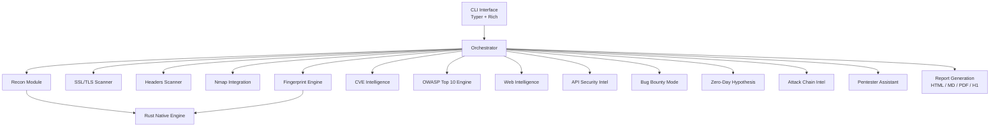

<p align="center">
  <pre align="center">
   ____ _           _   ____ _           _
  / ___| |__   ___ | |_/ ___(_)_ __ ___ | |_ ___ _ __
 | |  _| '_ \ / _ \| __\___ \| | '_ ` _ \| __/ _ \ '__|
 | |_| | | | | (_) | |_ ___) | | | | | | | ||  __/ |
  \____|_| |_|\___/ \__|____/|_|_| |_| |_|\__\___|_|
  </pre>
  <h3 align="center">Offensive Security Intelligence Platform</h3>
  <p align="center">
    <em>Reconnaissance · Intelligence · Attack Chains · Reporting</em>
  </p>
</p>

---

<div align="center">

[](https://python.org)
[](https://rust-lang.org)
[](https://docker.com)
[](https://github.com/your-org/ghostmirror)
[](https://github.com/your-org/ghostmirror/releases)
[](LICENSE)
[](SECURITY.md)
[](https://github.com/your-org/ghostmirror/actions)
[](https://github.com/your-org/ghostmirror)
[]()

</div>

---

## GhostMirror

GhostMirror is an **authorized offensive security intelligence platform** that transforms reconnaissance, web/API analysis, vulnerability intelligence, attack chains, zero-day hypotheses and pentester guidance into actionable reports.

> **AUTHORIZED USE ONLY**
>
> GhostMirror must only be used on systems you own or are explicitly authorized to test.
> Unauthorized use is illegal. See [SECURITY.md](SECURITY.md) for details.

---

## Features

| Category | Capabilities |
|----------|-------------|
| **Recon** | Passive surface mapping, URL normalization, technology identification |
| **SSL/TLS** | Certificate analysis, protocol support, cipher suite enumeration, misconfiguration detection |
| **Headers** | HTTP security headers audit (OWASP recommended set) |
| **Nmap** | Port scanning integration with service detection |
| **Fingerprint** | Technology fingerprint (15+ web technologies via native Rust engine) |
| **CVE Intelligence** | CVE matching, severity scoring, exploitability assessment |
| **EPSS/KEV** | Exploit Prediction Scoring System & Known Exploited Vulnerabilities correlation |
| **Exploit Intelligence** | Exploit availability checking, PoC reference matching |
| **Web Intelligence** | OWASP Top 10 Light Engine (safe, read-only A01–A10 checks) |
| **API Security** | Non-destructive API analysis: inventory, Swagger/OpenAPI discovery, GraphQL detection, JWT intelligence, OAuth mapping, BOLA/BFLA/Mass Assignment indicators |
| **Bug Bounty Mode** | Headless recon, JS analysis, API discovery, parameter mining, secrets detection, subdomain discovery, automated reporting |
| **Zero-Day Hypothesis** | Anomaly detection, differential analysis, hidden functionality discovery, business logic mapping, structured hypothesis generation with confidence scoring |
| **Attack Chain Intelligence** | Signal collection from 10+ modules, attack graph construction, 10 chain templates, scoring (0-100), prioritization, evidence linking |
| **Pentester Assistant** | Context-aware guidance copilot with triage, investigation planning, validation checklists, HackerOne submission guidance |
| **HackerOne Reporting** | Professional bug bounty report generation with HackerOne/Bugcrowd format export |
| **Lab Mode** | Controlled vulnerable environments (Juice Shop, DVWA, WebGoat, Vuln Demo) for training and testing |
| **Rust Engine** | High-performance port scanner, banner grabber, HTTP fingerprint (native Rust binary) |

---

## Architecture



---

## Quick Start

```bash
# Clone
git clone https://github.com/your-org/ghostmirror.git
cd ghostmirror

# Python environment
python -m venv .venv
source .venv/bin/activate   # Linux/macOS
# .venv\Scripts\Activate.ps1  # Windows

# Install GhostMirror
pip install -e .

# Verify installation
ghostmirror doctor

# List available labs
ghostmirror lab list

# Full scan on lab target
ghostmirror full-scan --project lab-juice-shop --profile bounty
```

---

## CLI Preview

```
╭──────────────────────────────────────────────╮
│                                              │
│   👻 GhostMirror                             │
│   Offensive Security Intelligence Platform   │
│                                              │
│   [1] New Project                            │
│   [2] Quick Scan                             │
│   [3] Full Scan                              │
│   [4] Labs                                   │
│   [5] Reports                                │
│   [6] System                                 │
│                                              │
│   [0] Exit                                   │
│                                              │
╰──────────────────────────────────────────────╯
```

---

## Example Workflow

```bash
# Start a lab environment
ghostmirror lab start juice-shop

# Create a project for the lab
ghostmirror lab create-project juice-shop

# Run a full bug bounty scan
ghostmirror full-scan --project lab-juice-shop --profile bounty

# Generate all report formats
ghostmirror report generate --project lab-juice-shop --format all
```

---

## Report Outputs

| Format | Description |
|--------|-------------|
| **HTML** | Rich interactive report with findings, severity breakdown, and evidence |
| **Markdown** | Clean markdown report for version control and sharing |
| **PDF** | Print-ready PDF with cover page and executive summary |
| **HackerOne** | Pre-formatted HackerOne bug bounty submission |
| **Bugcrowd** | Pre-formatted Bugcrowd vulnerability submission |
| **Assistant Report** | Pentester Assistant generated copilot guidance report |
| **Attack Chain Report** | Structured attack chain intelligence report |
| **Research Queue** | Zero-Day Hypothesis research queue with prioritized items |

---

## Roadmap

| Version | Focus | Status |
|---------|-------|--------|
| v2.0-alpha | Platform foundation, intelligence engines, lab mode | ✅ Complete |
| v2.1-beta | UI/UX polish, English localization, performance optimization | 🔄 In Progress |
| v2.2 | Web dashboard, real-time monitoring, team collaboration | 📅 Planned |
| v2.3 | Knowledge graph, automated attack path generation, ML-assisted triage | 📅 Planned |

---

## Responsible Disclosure

Found a vulnerability in GhostMirror itself? Please read our [Security Policy](SECURITY.md) for responsible disclosure guidelines.

**Do not** open public issues for security vulnerabilities. Open a private security advisory instead.

---

## License

[MIT](LICENSE) — Copyright (c) 2026 William Reis / GhostMirror contributors.
